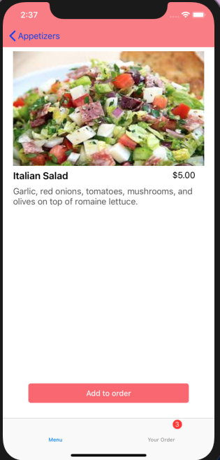
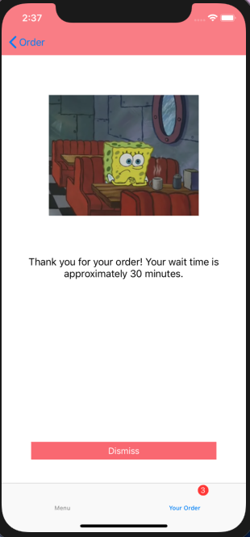

###  Restaurant 

In deze app kan je gerechten bestellen. De gerechten staan gefilterd door middel van categorieën. Je kan meer informatie krijgen over een gerecht door op het gerecht te klikken. Vervolgens kan je het gerecht bestellen en zal je nadat je je bestelling geplaatst hebt zien hoe lang het nog zal duren voordat je bestelling klaar is. De app slaat de data op zodat je ook nadat de app is afgesloten verder kan gaan met bestellen. 

#### Extra
Er is state restoration toegevoegd om de user experience te verbeteren. Dit was een optie die werd aangeraden vanuit het boek. 

